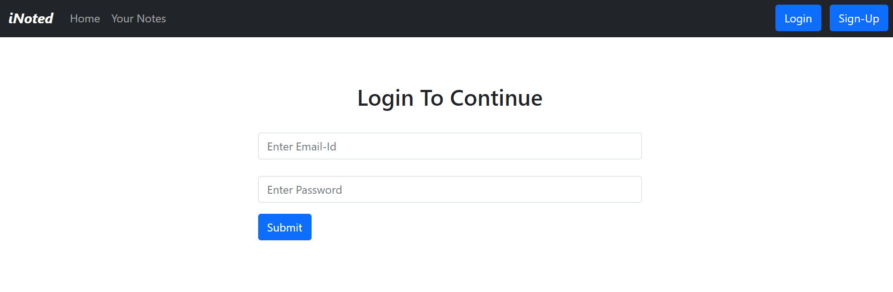
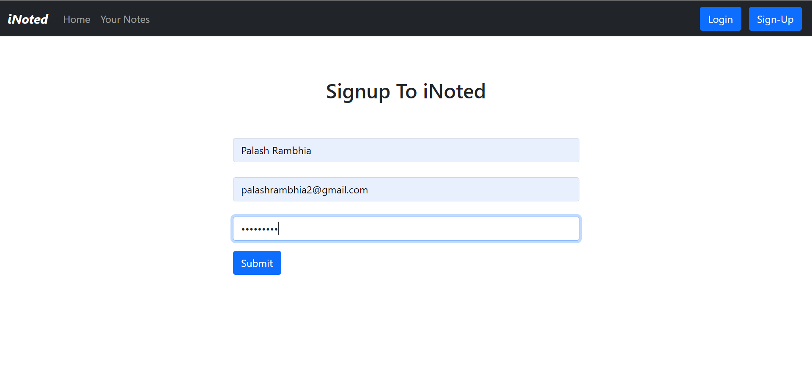
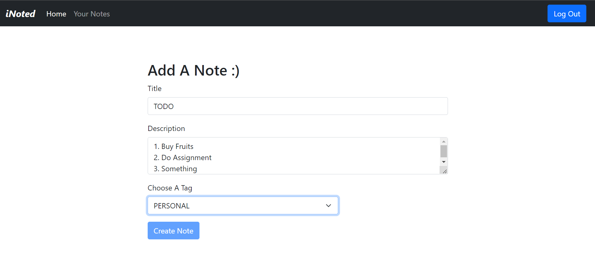
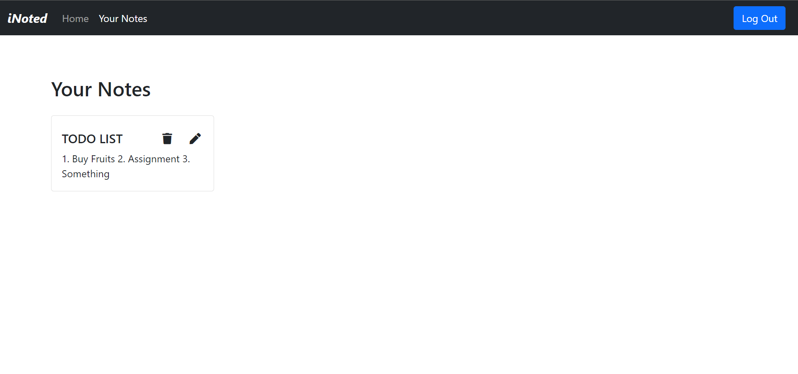
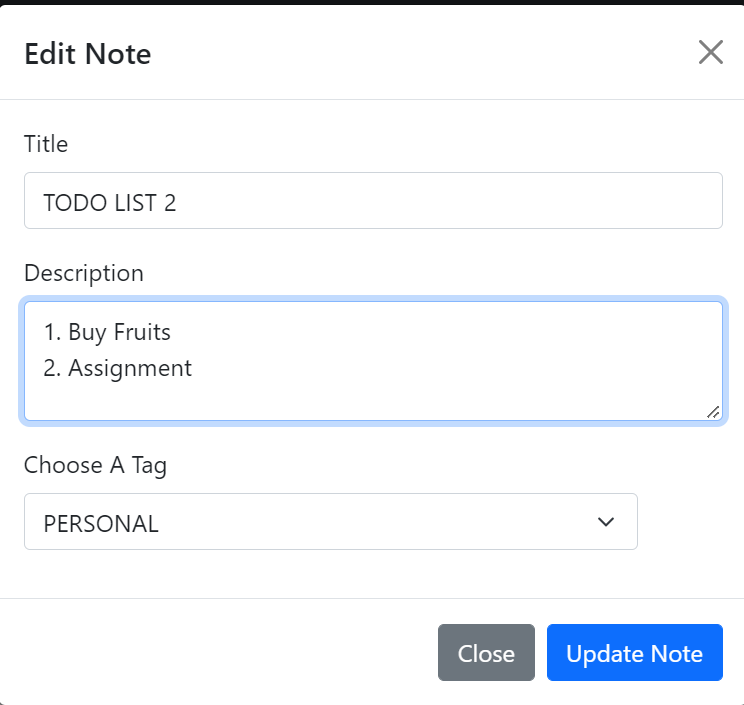

# MERN_Noted
iNoted is a Full MERN stack application. It has features such as Login/Signup for individual users, Adding, updating , deleting and showing all the user notes. This application is my first MERN stack application, it is a small step for me towards learning more

## Screen Shots

